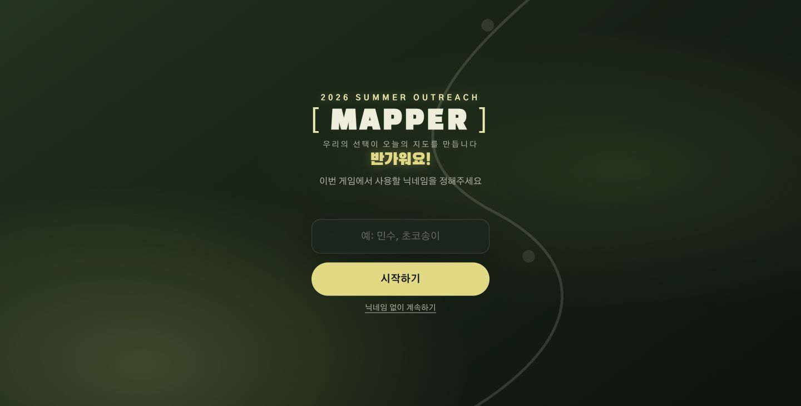
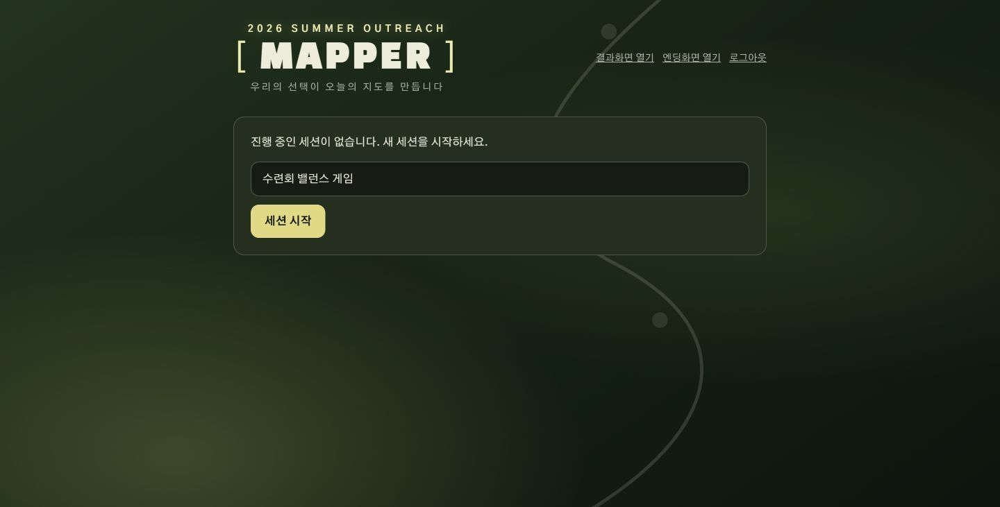
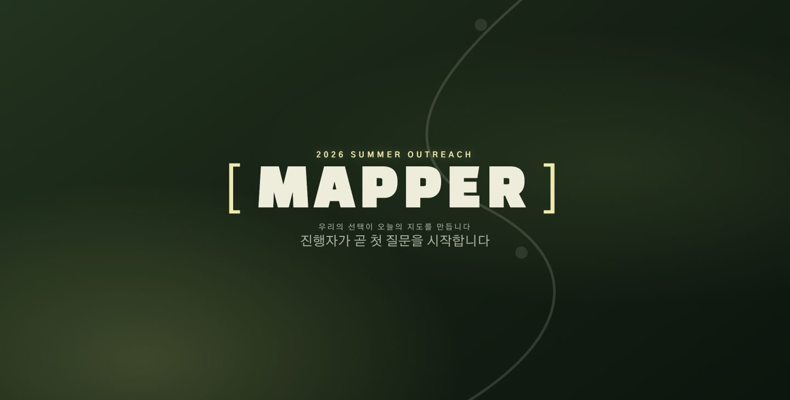

# Outreach Balance Game

2026 여름 아웃리치 현장에서 사용하는 실시간 A/B 밸런스 게임입니다. 참가자는 휴대전화로 투표하고, 진행자는 관리자 화면에서 질문과 세션을 운영하며, 발표 화면에는 현재 결과와 전체 결과가 표시됩니다.

> **행사일:** 2026년 8월 16일(일)<br>
> **운영 사이트:** [https://outreach-balance-game-live.vercel.app](https://outreach-balance-game-live.vercel.app)

## 주요 기능

- 모바일 참가자 투표 및 브라우저별 중복 투표 방지
- 관리자 비밀번호 로그인, 세션·질문 생성, 순서 변경, 시작·종료·초기화
- 행사 진행 화면(`/results`)과 최종 결과 발표(`/final`) 화면
- Supabase 기반 데이터 저장 및 집계
- 행사 현장 네트워크를 고려한 주기적 자동 갱신
- GitHub Actions 품질 검사와 Vercel 자동 배포

## 화면

| 참가자 | 관리자 | 행사 진행 화면 |
|---|---|---|
|  |  |  |

## 행사 당일 링크

| 화면 | 링크 | 용도 |
|---|---|
| 참가자 | [사이트 열기](https://outreach-balance-game-live.vercel.app/) | 참가자 모바일 투표·QR 연결 주소 |
| 관리자 | [관리자 열기](https://outreach-balance-game-live.vercel.app/admin) | 진행자용 운영 화면 |
| 행사 진행 화면 | [진행 화면 열기](https://outreach-balance-game-live.vercel.app/results) | 질문·카운트다운·종료 결과를 프로젝터에 표시 |
| 최종 결과 발표 | [최종 발표 열기](https://outreach-balance-game-live.vercel.app/final) | 실제 투표가 있었던 질문의 결과 슬라이드 |

## 기술 구성

- Next.js 14 · React 18 · TypeScript · Tailwind CSS
- Supabase Postgres
- Vercel
- GitHub Actions

## 시작하기

상세한 Supabase 설정, 로컬 실행, Vercel 배포, 행사 당일 운영 순서는 [설치 및 배포 가이드](docs/설치-및-배포-가이드.md)를 참고하세요.

```bash
npm ci
copy .env.example .env.local
npm run dev
```

환경변수의 실제 값은 `.env.local`과 Vercel 프로젝트 설정에만 저장합니다. 저장소에는 커밋하지 않습니다.

## CI/CD

- Pull Request와 `main` 푸시마다 `npm run lint`와 `npm run build`가 실행됩니다.
- Vercel Git 연동 후 브랜치 푸시는 Preview, `main` 푸시는 Production으로 자동 배포됩니다.
- 데이터베이스 변경은 자동 실행하지 않습니다. 행사 데이터 보호를 위해 `supabase/` SQL을 검토한 뒤 Supabase SQL Editor에서 수동 적용합니다.

## 현장 운영 요약

1. 행사 전에 실제 세션과 질문을 입력해 참가자·관리자·행사 진행 화면을 점검합니다.
2. 실제 진행 직전에 맨 아래 `행사 준비·관리`에서 리허설 투표만 초기화합니다. `새 세션`은 질문을 복사하지 않습니다.
3. 참가자에게 `/` QR을 공유하고 발표 장비에서는 `/results`를 전체 화면으로 엽니다.
4. 질문을 차례로 시작·종료한 뒤 `/final`로 전체 결과를 보여줍니다.

담당자에게 전달할 준비·리허설·당일 진행·장애 대응 절차는 [행사 운영 시나리오](docs/행사-운영-시나리오.md)를 참고하세요.

## 라이선스

행사 운영을 위한 내부 프로젝트입니다.
